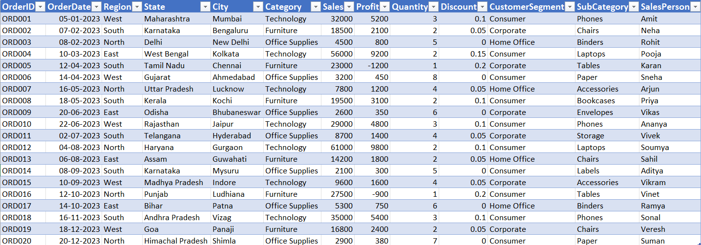
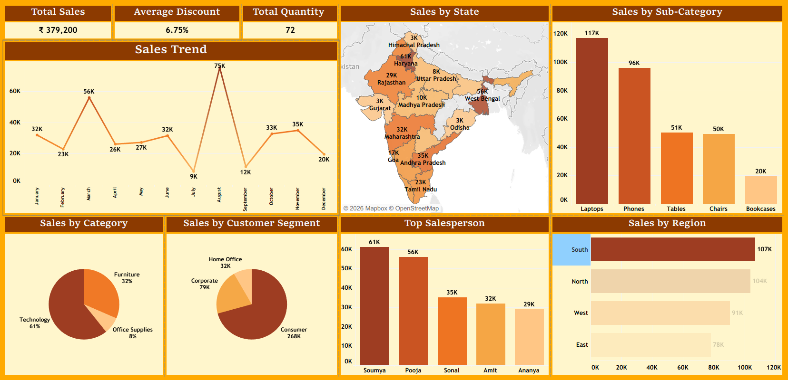
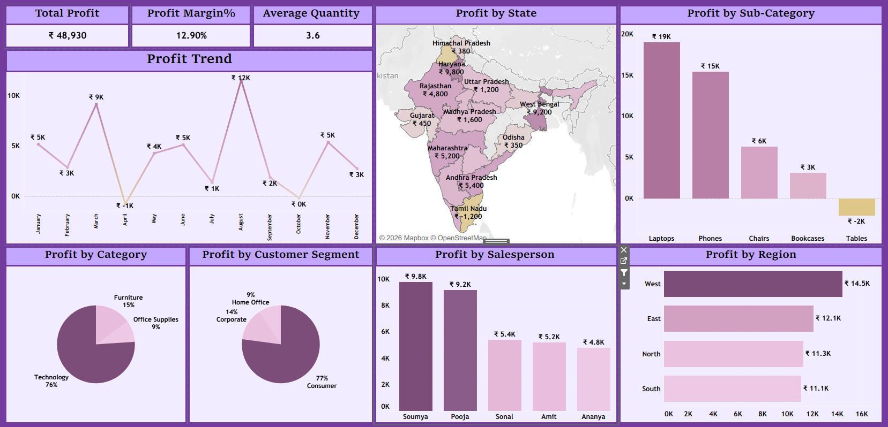

# Retail Sales & Profit Analysis Dashboard (Tableau)

## Project Overview

This project analyzes retail sales transactions across different regions of India to understand sales performance, profitability trends, product performance, and salesperson effectiveness.

The analysis follows a structured data analytics workflow:

Raw Data - Data Cleaning - Data Analysis - Dashboard Visualization - Business Insights

Two analytical dashboards were developed:

1. Sales Performance Dashboard
2. Profit Analysis Dashboard

These dashboards provide business insights that help identify revenue drivers, profitability patterns, and operational improvement opportunities.

---

## Executive Summary

This project analyzes retail sales and profitability to identify not just revenue performance, but where the business is actually making or losing money.

The analysis reveals that while certain categories and sub-categories generate strong sales, profitability is uneven and often concentrated in a limited set of high-performing segments. At the same time, some sub-categories contribute to revenue but deliver weak profit, indicating potential inefficiencies in category and sub-category mix and cost structure.

Regional and category-level differences further highlight that high sales volume does not always translate into strong profit performance, suggesting gaps in pricing, cost control, or product strategy.

The dashboard enables stakeholders to:

- Identify high-profit vs low-profit sub-categories
- Detect profit concentration and dependency risks
- Analyze category-level profitability performance
- Evaluate regional differences in profit efficiency

Overall, the project shifts focus from revenue tracking to profit optimization, enabling better decision-making around product strategy, cost management, and business growth.

---

## Business Context

A retail company operating across multiple regions in India wants to better understand its sales performance and profitability patterns.

Management is interested in identifying:

- Which categories and sub-categories generate the most revenue  
- Which regions contribute the highest profit  
- Which sales representatives perform the best  
- Which sub-categories are generating losses   
- How sales and profits change throughout the year  

The insights from this analysis can help the company improve pricing strategies, optimize inventory planning, and focus on profitable product segments.

---

## Business Objective

The primary objective of this project is to transform raw transactional sales data into meaningful business insights that support data-driven decision making.

Key objectives include:

- Understanding sales performance across regions  
- Identifying sub-categories that generate losses 
- Evaluating profitability by sub-category  
- Measuring salesperson performance  
- Monitoring sales and profit trends over time  

---

## Dataset Preview

Below is a preview of the dataset used for this analysis.



---

## Dataset Information

### Dataset Fields

| Column | Description |
|------|-------------|
OrderID | Unique identifier for each order |
OrderDate | Date of order |
Region | Sales region |
State | State where the order occurred |
City | City of the transaction |
Category | Product category |
Sales | Revenue generated from the order |
Profit | Profit earned from the order |
Quantity | Number of items sold |
Discount | Discount applied to the sale |
CustomerSegment | Customer type |
SubCategory | Product sub-category |
SalesPerson | Sales representative responsible |

All monetary values are recorded in **Indian Rupees (₹).**

---

## Data Cleaning Process

The original dataset was received in **raw text format** and required preprocessing before analysis.

The following steps were performed in **Microsoft Excel**:

- Converted tab-separated text data into a structured tabular dataset  
- Standardized column headers  
- Verified numeric formats for Sales, Profit, Quantity, and Discount  
- Checked for missing or inconsistent values  
- Ensured consistent date formatting for OrderDate  
- Prepared the dataset for analysis in Tableau  

The cleaned dataset was then imported into Tableau for dashboard creation.

---

# Sales Dashboard

## Dashboard Visualization



**Interactive Dashboard:**  
View the interactive version on Tableau Public:
https://public.tableau.com/app/profile/sarvesh.vernekar/viz/retail_sales_analysis_dashboard/SalesAnalysis?publish=yes

---

## Dashboard Features

The Sales Dashboard includes:
  
- Monthly sales trend analysis
- Geographic sales distribution by state  
- Sales contribution by sub-category
- Sales contribution by category
- Sales contribution by customer segment  
- Sales performance by salesperson  
- Sales comparison by region
  
These visualizations allow quick identification of high-performing categories, sub-categories, and regions.

---

## Business Problems Addressed

The Sales Dashboard addresses the following business questions:

- Which regions generate the highest sales?  
- Which product categories contribute the most revenue?  
- Which customer segments generate the most sales?
- Which state has the highest sales?  
- How do sales fluctuate across different months?  
- Which sales representatives contribute most to revenue?

---

## KPIs

Key metrics included in the sales dashboard:

- Total Sales - ₹3,79,200
- Average Discount - 6.75%
- Total Quantity - 72 

---

## Key Insights & Business Recommendations

### Insights

- The South region generates the highest sales, followed by other regions, indicating strong customer demand in that market.

- Technology category contributes the largest share of revenue, making it the primary sales driver.

- The Consumer segment generates the highest sales, showing that individual customers dominate the market.

- Haryana state accounts for a large portion of total sales with ₹61K.

- Sales fluctuate across different months, suggesting seasonal demand patterns.

- Soumya is the top-performing sales representative, contributing a significant share of total sales.


### Business Recommendations

- Strengthen inventory availability and marketing efforts in the South region to capitalize on high demand.

- Expand the Technology product category and prioritize it in promotions.

- Implement targeted marketing campaigns for the Consumer segment to increase retention and repeat purchases.

- Replicate successful sales strategies from high-performing states in lower-performing states like Gujarat, Odisha and Himachal Pradesh.

- Plan seasonal promotions and demand forecasting to handle monthly sales fluctuations.

- Introduce performance-based incentives and training programs to improve sales team productivity.

---

# Profit Dashboard

## Dashboard Visualization



**Interactive Dashboard:**  
View the interactive version on Tableau Public: 
https://public.tableau.com/app/profile/sarvesh.vernekar/viz/retail_sales_analysis_dashboard/ProfitAnalysis?publish=yes

---

## Dashboard Features

The Profit Dashboard includes:

- Monthly profit trend analysis
- Geographic profit distribution by state  
- Profit contribution by sub-category
- Profit contribution by category
- Profit contribution by customer segment  
- Profit contribution by salesperson  
- Profit comparison by region
  
These visuals help identify profitability drivers and potential business risks.

---

## Business Problems Addressed

The Profit Dashboard focuses on answering the following questions:

- Which regions generate the highest profit?  
- Which sub-categories deliver the best profit margins?
- Which salespersons contribute most to profitability?
- Which sub-categories generate losses?
- How does profit change over time?
- Which state generates losses?

---

## KPIs

Key profitability metrics include:

- Total Profit: ₹48,930  
- Profit Margin: 12.9%  
- Average Quantity per Order: 3.6  

---

## Key Insights & Business Recommendations

### Insights

- The West region contributes the highest share of total profit.

- Laptops and Phones generate the highest profits among sub-categories.
  
- Soumya and Pooja are top-performing salespersons in terms of profitability.
     
- The Tables sub-category generates negative profit.  
 
- Profit fluctuates throughout the year, indicating variability in overall performance.

- Punjab and Tamil Nadu generate negative profit.


### Business Recommendations

- Focus marketing and inventory efforts in the West region to maximize profitability in the highest profit-generating market.

- Promote high-margin products like laptops and phones to further increase overall profit.

- Analyze and replicate the sales strategies of Soumya and Pooja to improve overall team profitability.

- Review pricing, costs, and discount strategies for the Tables sub-category to address negative profit.

- Improve demand forecasting and seasonal promotions to manage profit fluctuations throughout the year.

- Investigate pricing, logistics, and discount strategies in Punjab and Tamil Nadu to reduce losses and improve profitability.

---

## Conclusion

The analysis shows that business performance is profit-driven but uneven, with a significant portion of total profit coming from a limited number of categories and sub-categories.

While revenue remains strong, profit distribution is concentrated, creating risk if key segments underperform. Additionally, the presence of lower-profit sub-categories suggests inefficiencies in the current product mix.

Regional and category-level variations indicate that not all sales contribute equally to business value, reinforcing the need to evaluate performance beyond revenue.

To achieve sustainable growth, the business must shift focus toward:

- Profit contribution by category and sub-category
- Reducing dependency on top-performing segments
- Improving overall profit efficiency across regions

A more balanced and profit-focused strategy will be critical for long-term success.

---

## Strategic Takeaway

The business is generating revenue effectively, but profitability is uneven across regions, categories, sub-categories, and sales performance dimensions.

A significant portion of profit is driven by specific sub-categories (e.g., laptops, phones) and top-performing salespersons, while certain sub-categories (such as Tables) and regions contribute negatively.

To achieve sustainable growth, the business must shift from overall sales growth to consistent profit generation across categories, sub-categories, regions, and salesperson performance.

---

## Business Impact

If these recommendations are implemented, the business can:

- Improve profit margins by addressing loss-making sub-categories such as Tables and optimizing pricing or cost structures
- Increase profitability by focusing on high-performing sub-categories such as laptops and phones
- Reduce financial losses by fixing underperforming regions such as Punjab and Tamil Nadu
- Improve sales team effectiveness by scaling strategies used by top performers like Soumya and Pooja

---

## Risk & Limitations

- The dataset does not include detailed cost breakdowns (e.g., logistics, marketing, operational costs), limiting deeper profitability analysis.
- Customer-level behavior data is not available, restricting insights into customer profitability and retention patterns.
- External factors such as pricing strategy changes or market competition are not captured in the dataset.

---

## Next Steps / Future Analysis

- Perform deeper analysis of loss-making sub-categories (e.g., Tables) to determine root causes such as pricing, cost, or discounting
- Conduct region-wise profitability diagnostics for states like Punjab and Tamil Nadu to identify operational inefficiencies
- Analyze salesperson performance patterns to replicate strategies used by top performers
- Evaluate the impact of discounts on profit margins to identify optimal pricing strategies
- Expand dataset size to validate trends and improve reliability of insights

---

## Tools Used

- Microsoft Excel – Data cleaning and preparation  
- Tableau – Data visualization and dashboard development  

---

## Skills Demonstrated

- Data Cleaning  
- Data Preparation  
- Data Visualization  
- Business Analysis  
- KPI Development  
- Dashboard Design  
- Insight Generation  
- Data Storytelling  

---

## Files Included

This repository contains the following files:

- Raw dataset (text format)  
- Cleaned dataset (Excel format)  
- Tableau packaged workbook (.twbx)  
- Dataset preview screenshot  
- Sales dashboard screenshot  
- Profit dashboard screenshot  

---

## Project Structure

```
Retail-Sales-Profit-Analysis-Tableau
│
├── data
│   ├── raw_sales_data.txt
│   └── cleaned_sales_dataset.xlsx
│
├── dashboards
│   └── retail_sales_analysis_dashboard.twbx
│
├── images
│   ├── dataset_preview.png
│   ├── sales_dashboard.png
│   └── profit_dashboard.png
│
└── README.md
```

---

## How to Use

1. Download or clone the repository
2. Open the Tableau packaged workbook (.twbx)
3. Explore the interactive dashboards
4. Review insights derived from the visualizations

---

## Repository Structure

The repository is organized to separate:

- README.md - Documentation containing project overview, business objectives, dashboards, insights, and recommendations.
- raw_sales_data.txt - Original raw dataset before data cleaning.
- cleaned_sales_dataset.xlsx - Cleaned dataset prepared for analysis and visualization.
- retail_sales_analysis_dashboard.twbx - Tableau packaged workbook containing interactive dashboards.
- dataset_preview.png - Screenshot preview of the dataset used for the analysis.
- sales_dashboard.png - Screenshot of the Sales Performance Dashboard.
- profit_dashboard.png - Screenshot of the Profit Analysis Dashboard.

This structure ensures clarity and easy navigation.

---

## Dataset Limitations

- The small dataset size (20 transactions) limits the reliability of trends and patterns, and insights should be interpreted as directional rather than conclusive.
- The dataset contains only 20 transactions which limits large-scale trend analysis
- The dataset represents a simplified retail scenario
- Additional variables such as product cost, inventory levels, and customer lifetime value could enable deeper analysis

---

## Author

Sarvesh Vernekar

MBA Graduate | Data & Business Analysis Enthusiast

This project demonstrates the ability to transform raw sales data into meaningful business insights using data cleaning, visualization, and analytical thinking.
